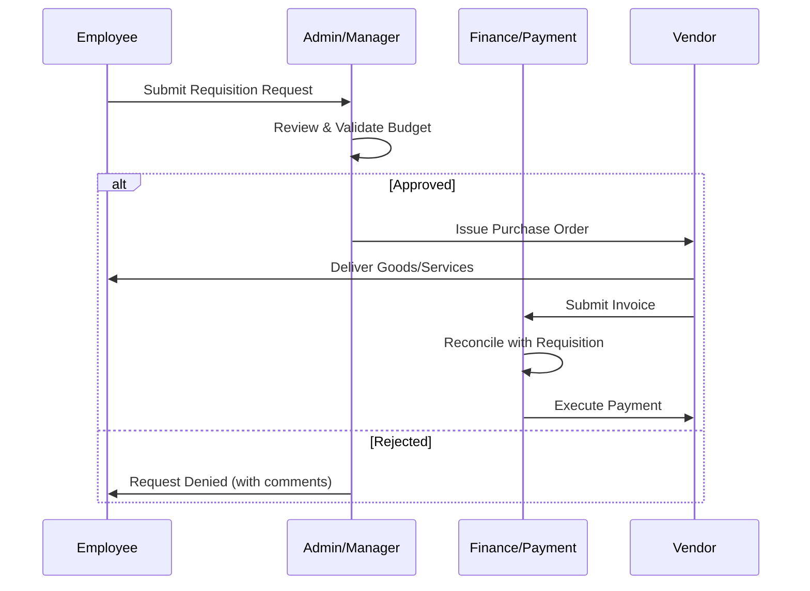

# AMZA PROJECT: Unified Management Ecosystem

## 1. Executive Summary
The **AMZA Project** is a comprehensive enterprise management solution designed to streamline organizational workflows. By integrating robust administration tools, employee self-service capabilities, precise financial tracking, and structured procurement requests, AMZA provides a "single pane of glass" for modern business operations.

---

## 2. Core Modules

### 🔐 2.1 Admin Portal
The central command center for system administrators and stakeholders.

*   **Global Dashboard**: Real-time analytics on company performance, budget health, and pending approvals.
*   **User & Role Management**: Granular RBAC (Role-Based Access Control) to manage permissions across the organization.
*   **Audit Logging**: Comprehensive tracking of all system actions for transparency and security.
*   **System Configuration**: Manage global settings, tax rates, currency, and integration API keys.

### 👤 2.2 Employee Portal
A focused interface for staff to manage their professional data and internal interactions.

*   **Personal Dashboard**: View assigned tasks, upcoming deadlines, and announcement feeds.
*   **Profile Management**: Self-service updates for personal information, banking details, and emergency contacts.
*   **Request Workspace**: Centralized location to submit and track Requisitions or Time-off.
*   **Performance Metrics**: Access to KPIs and periodic performance reviews.

---

## 3. Financial & Operational Management

### 💳 3.1 Payment Management
Ensures financial integrity through automated tracking and processing.

*   **Billing & Invoicing**: Generate and manage outgoing invoices and track incoming payments.
*   **Payroll Integration**: Seamless connection between employee records and monthly disbursements.
*   **Expense Reimbursement**: Workflow for employees to claim business-related expenses with receipt verification.
*   **Financial Reporting**: automated generation of P&L statements, balance sheets, and tax summaries.

### 📋 3.2 Requisition Management
A structured workflow for procurement and resource allocation.

*   **Smart Requests**: Itemized submission forms with budget category mapping.
*   **Approval Workflows**: Multi-stage approval paths based on department, cost center, or expenditure amount.
*   **Vendor Management**: Centralized database of approved suppliers and performance history.
*   **Inventory Integration**: Checks real-time stock levels before initiating new purchase orders.

---

## 4. System Architecture

### 4.1 Process Flow
The following diagram illustrates the interaction between the Requisition and Payment modules.

### 4.2 Technology Stack
*   **Frontend**: Next.js (React) for a high-performance, SEO-friendly user interface.
*   **State Management**: React Query for efficient server-state handling.
*   **Styling**: Vanilla CSS & Tailwind Architecture for a premium design feel.
*   **Backend**: Node.js with Prisma ORM for robust data handling.
*   **Database**: PostgreSQL for relational data integrity.

---

## 5. Security & Compliance
*   **Data Encryption**: AES-256 at rest and TLS 1.3 in transit.
*   **Authentication**: Multi-factor authentication (MFA) support for all portals.
*   **Compliance**: GDPR-ready data handling and privacy controls.

---

> [!TIP]
> **Next Steps**: Focus on implementing the `RequestStatus` enum in the database schema to synchronize the Requisition and Payment workflows.
